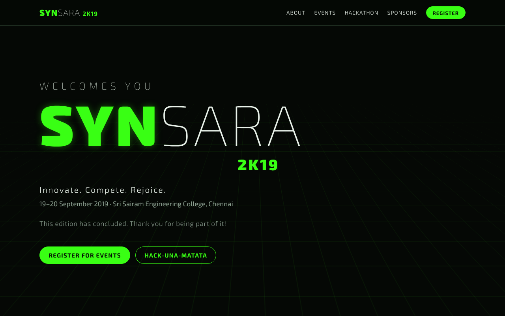
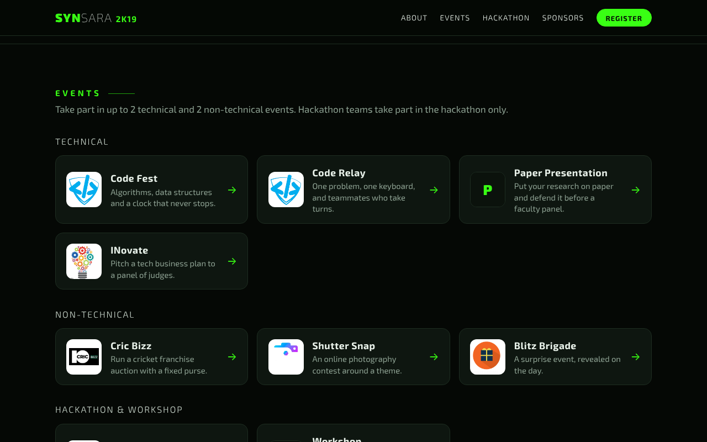
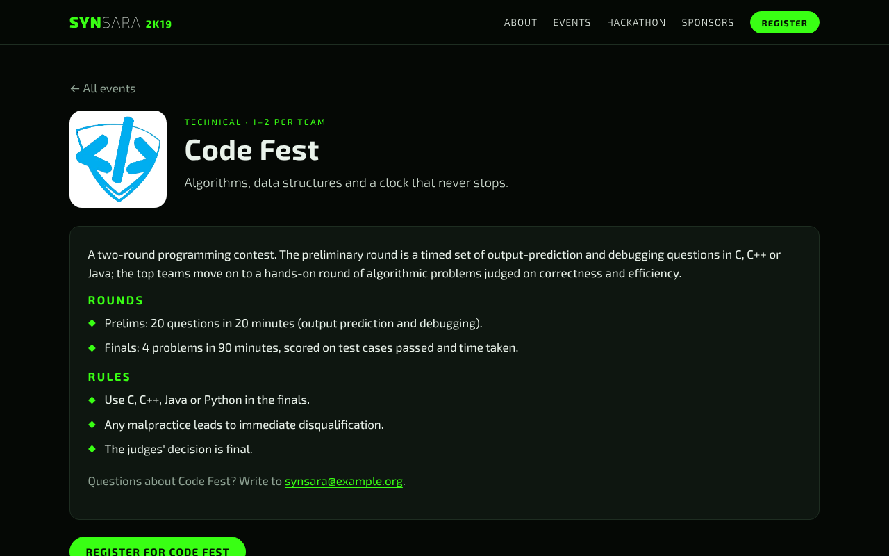
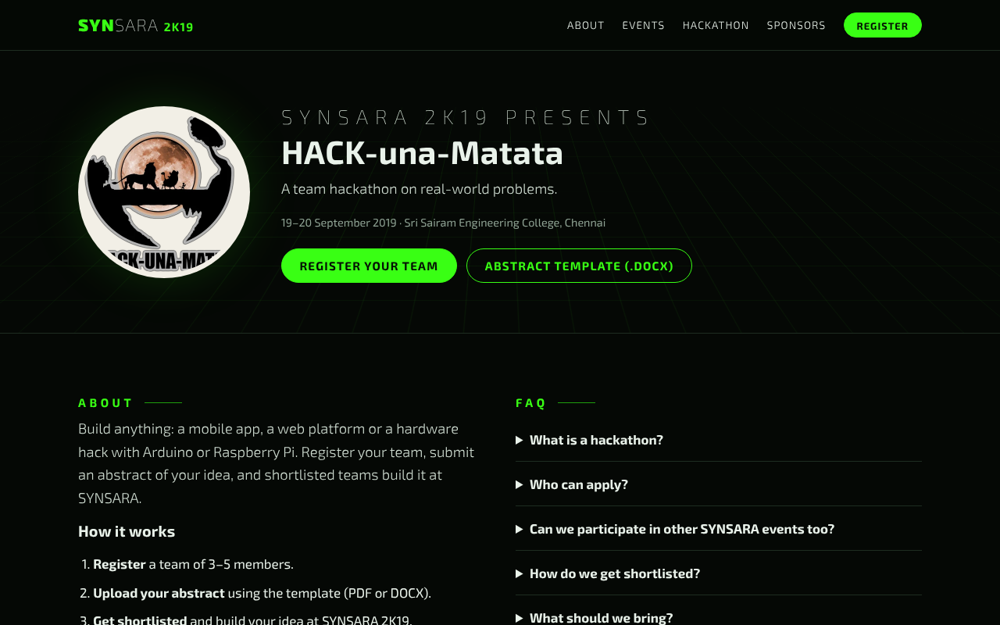
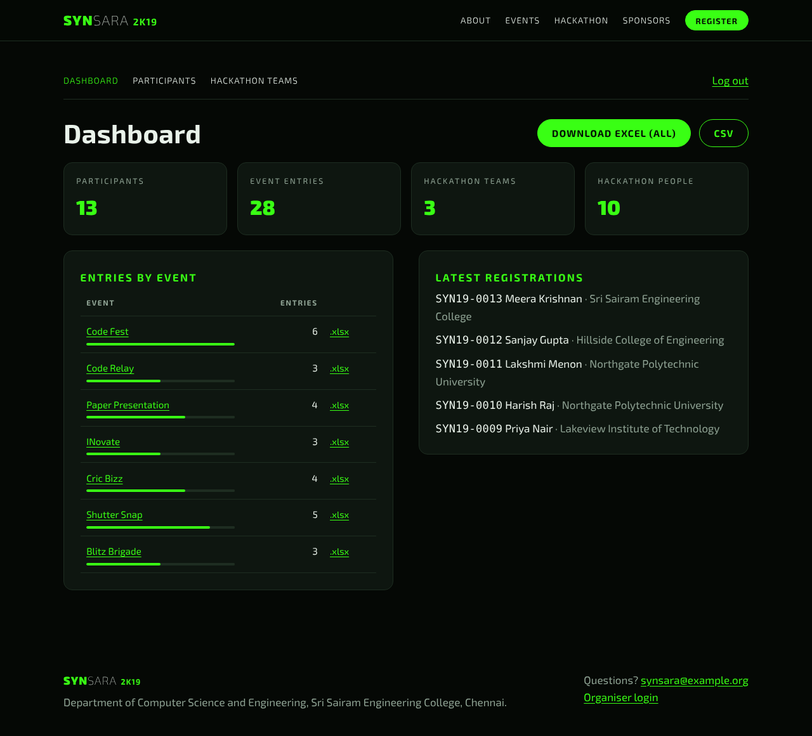
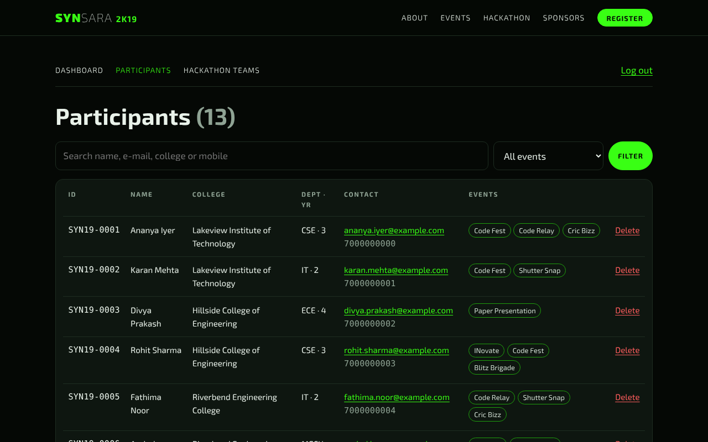

# SYNSARA 2K19: Symposium Website and Registrations

[](https://github.com/imkarthiknr/synsara-2019/actions/workflows/ci.yml)


SYNSARA is the national technical symposium of the Department of Computer Science and Engineering at Sri Sairam Engineering College, Chennai. This repository is the website and registration system for the **2019 edition (19–20 September 2019)**: event pages, event registration, team registration for the **HACK-una-Matata** hackathon with abstract upload, and an organiser console with Excel exports.

It began in 2019 as a PHP and MySQL site. In 2026 it was rebuilt with the same look and features on a modern, secure and tested stack. See [What changed from 2019](#what-changed-from-2019) and the [CHANGELOG](CHANGELOG.md).

| Home | Events | Event page |
| --- | --- | --- |
|  |  |  |
| **Hackathon** | **Organiser dashboard** | **Participants** |
|  |  |  |

More screenshots, including the forms and the mobile layout, are in [docs/screenshots](docs/screenshots).

## Features

**Participants**
- **Event pages** for the 9 events: Code Fest, Code Relay, Paper Presentation and INovate (technical); Cric Bizz, Shutter Snap and Blitz Brigade (non-technical); the HACK-una-Matata hackathon; and a workshop.
- **One registration per person** for up to 2 technical and 2 non-technical events. The form enforces the limits as you tick, and the server checks them again.
- A **registration ID** (`SYN19-0001`) on success. Duplicate e-mails and mobile numbers are rejected.
- **Hackathon team registration** for 3–5 members with an **abstract upload** (PDF or DOCX, checked by content, 5 MB limit) and a downloadable abstract template. Hackathon teams can't also enter other events, as in 2019.
- The original look: black and neon green, the Exo 2 typeface and the "WELCOMES YOU" text scramble. It works on phones and respects reduced-motion settings.

**Organisers** (`/admin`)
- **Dashboard** with participant, entry and team counts and entries per event.
- **Participants** list with search and an event filter, plus delete.
- **Hackathon teams** with members, project details and the abstract download.
- **Excel export** with an "All participants" sheet, one sheet per event and a hackathon sheet. Also per-event `.xlsx` files and a CSV.

All event content (names, rules, rounds, dates, limits) lives in one YAML file, [`content/synsara-2019.yaml`](content/synsara-2019.yaml), so another edition only needs a new content file.

## Quick start

### Docker (PostgreSQL + app)

```bash
git clone https://github.com/imkarthiknr/synsara-2019.git
cd synsara-2019
docker compose up --build
```

Open <http://localhost:8000>. The organiser console is at <http://localhost:8000/admin> with `admin` / `synsara-admin`. To load fictional demo registrations:

```bash
docker compose exec web python -m app.seed
```

Before running it anywhere public, copy [`.env.example`](.env.example) to `.env` and set `SECRET_KEY`, `ADMIN_PASSWORD` and `POSTGRES_PASSWORD`.

### Local development

You need Python 3.11+ and [uv](https://docs.astral.sh/uv/).

```bash
uv sync                       # install dependencies
uv run alembic upgrade head   # create the SQLite database in data/
uv run python -m app.seed     # optional: fictional demo data
uv run uvicorn app.main:app --reload
```

Setup details, configuration, architecture notes and troubleshooting are in [DEVELOPMENT.md](DEVELOPMENT.md).

## Architecture

```
Browser ──▶ FastAPI (server-rendered Jinja2 pages)
            │  web/public.py   home, events, registration, hackathon
            │  web/admin.py    login, dashboard, lists, exports, abstract download
            ▼
            services/          registration rules, hackathon + uploads, Excel/CSV exports
            ▼
            SQLAlchemy 2 ──▶ SQLite (local) or PostgreSQL (Docker)      data/uploads/ (abstracts)
            content/*.yaml ──▶ edition, events, rules (validated with Pydantic at start-up)
```

| Part | Tech |
| --- | --- |
| Web | FastAPI, Jinja2 templates, plain CSS and a small vanilla JS file (no build step) |
| Data | SQLAlchemy 2, Alembic migrations, SQLite or PostgreSQL |
| Validation | Pydantic v2 for forms and the content file |
| Exports | openpyxl (Excel), csv |
| Security | Signed session cookie for organisers, CSRF tokens on every form, strict Content Security Policy, content-sniffed uploads with random file names, spreadsheet formula-injection guard |

## Project structure

```
synsara-2019/
├── app/
│   ├── main.py              app factory, security headers, error pages
│   ├── content.py           content file models (edition, events, rules)
│   ├── models.py            participants, event entries, hackathon teams, members
│   ├── schemas.py           form validation
│   ├── seed.py              fictional demo data
│   ├── core/                settings, organiser login
│   ├── services/            registrations, hackathon, exports
│   ├── web/                 routes and templates (public, hackathon, admin)
│   └── static/              CSS, JS, images, Exo 2 fonts, abstract template
├── content/synsara-2019.yaml
├── migrations/              Alembic
├── tests/                   pytest
├── docs/screenshots/
├── Dockerfile, docker-compose.yml
└── DEVELOPMENT.md
```

## Testing

```bash
uv run pytest        # 43 tests: rules, uploads, admin, exports, CSRF, migrations
uv run ruff check .  # lint
```

CI runs the tests on Python 3.11 and 3.13 and against PostgreSQL, checks that the migrations match the models, then builds the Docker stack and registers a participant through it.

## What changed from 2019

| 2019 | 2026 |
| --- | --- |
| Database username and password in `config.php` | No secrets in code. Settings come from environment variables |
| The login page let anyone "Sign up now" for an account | One organiser account from the environment, signed session cookie, CSRF tokens on every form |
| Personal details passed between pages in the URL query string | Details stay in the POST body; only the new registration's ID is kept in the session |
| Every registration was appended to `.xlsx` files in a `downloads/` folder by PHPExcel | Excel and CSV exports are generated on request, behind the organiser login |
| Test registrations with real phone numbers and e-mails committed in those `.xlsx` files | No personal data in the repository. The demo data is fictional |
| Abstract uploads saved under the uploader's own file name | Uploads checked by content (PDF or DOCX), size-limited and stored under random names |
| Hackathon page forked from another site's template, with its own separate form | One hackathon page and form in the same design as the rest of the site |
| Bundled PHPExcel, jQuery 1.11 and several unused vendor libraries | Short dependency list, no frontend build, self-hosted fonts |
| Event details hard-coded in HTML | One YAML content file, validated at start-up |
| No tests or automation | pytest, a Playwright walkthrough, Docker and GitHub Actions |

The event write-ups were rewritten from the 2019 pages, and organiser phone numbers were replaced with one contact address.

> **Note:** the original 2019 commit is still in this repository's history. It contains a MySQL username and password in `config.php` and test registrations with personal phone numbers and e-mails in `downloads/*.xlsx`. Treat that password as compromised and change it wherever it's still used. The current tree contains none of it.

## Credits

SYNSARA 2K19 was organised by the Department of Computer Science and Engineering, Sri Sairam Engineering College. The original website was built by Karthik N R with the SYNSARA 2K19 web team. Exo 2 is by Natanael Gama under the [SIL Open Font License](app/static/fonts/OFL.txt).

## License

The code is [MIT](LICENSE) licensed. The SYNSARA and HACK-una-Matata names and logos belong to the organisers and are included to document the event.
